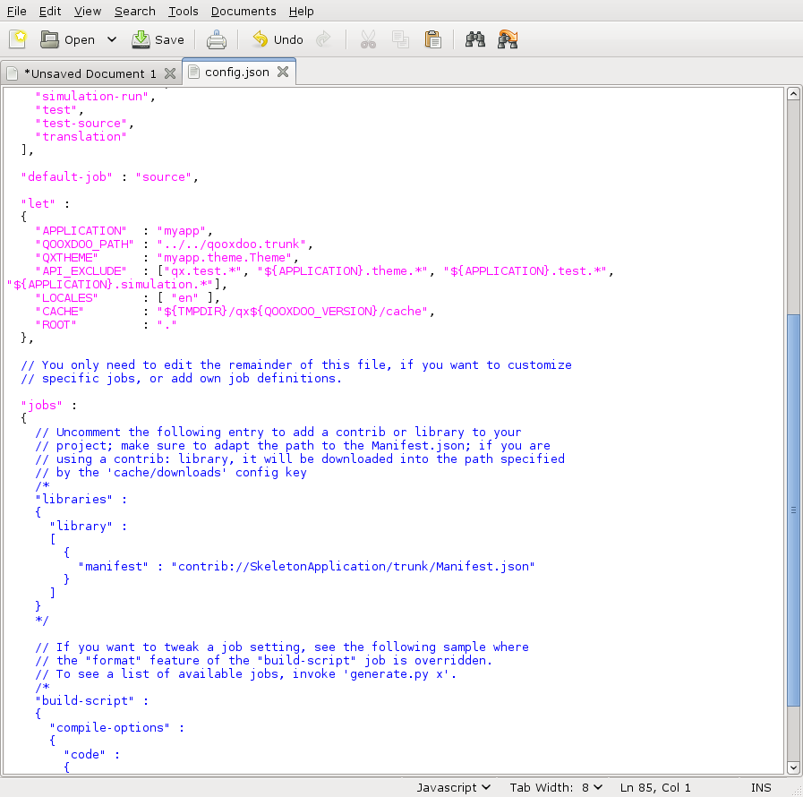

Configuration Usage
===================

The Generator's actions are driven by so called "jobs" (think of Make or Ant "tasks"), and all it does depends on which jobs you pass to it on the command line and how these jobs are defined. Jobs are defined in configuration files. The %{qooxdoo} SDK comes with a whole slew of pre-defined jobs which are ready to run, but you are also free to define entirely new jobs using the same building blocks as the pre-defined ones. More often, though, if you are not entirely satisfied with the pre-defined jobs you will want to work on a middle ground and tweak or adapt existing jobs so they suit you better.

This page tells you more about the inner workings of the configuration system and how to use it.

Skeleton Configuration
----------------------

When you create an application skeleton, a basic configuration file, `config.json`, is created along the way. With this config file you have access to all the standard jobs that are available for this type of skeleton. Usually, you will just run these jobs and be done with it, so there might never be a need for you to actually look inside the config file. The Generator will read the configuration file when invoked, analyze its contents and perform the job(s) you gave on the command line using the definitions provided through the configuration.

If you do, though, you will find that it doesn't contain much. The important part is that it includes job definitions from a system configuration file (like `application.json`). The other important item is a global `"let"` entry which gives you a first hold into customizing jobs. We'll get back to this later.

Moreover, there is a `"jobs` section which is mostly empty except for some comments that aim to guide you to fill it up should you find the need to do so.

Mechanisms of the Configuration System
--------------------------------------

Here are the fundamental mechanisms the configuration system works with.

### File Import

You can import the job definitions of one configuration file into another (using the top-level include key). Mind that you are only importing job definitions.

### Job Definitions

Job definitions are the main "meat" of every configuration. Job definitions make use of the basic configuration keys provided by the config system, this is how they achieve their effect.

Jobs can *extend* each other. Think of "extending" as one job inheriting the properties of the job it is extending. This way you can "subclass" jobs to customize them, or "abstract" common properties into jobs that are extended by several others.

There are two basic mechanisms of job extension. One is explicit, using the `extend` keyword in the job definition. The other is implicit, by defining a job in your configuration file that has the *same name* as a job you are importing from another file.

In the *extend* key you refer to other jobs by name. The resolution of such names is done *late*. That means, if you are importing a job "foo" from another file, which in turn extends a job "bar" then if you have a local job "bar" this one will be used. Otherwise, the job "bar" from the imported file will be used.

### Macros

Macros allow you to define values, and then refer to those values in other places of the configuration, by referring to the macro's name. Values can basically be any allowed JSON value type (strings, numbers, boolean, ...). Macros can only be defined with the pages/tool/generator/generator\_config\_ref\#let configuration key. It takes a map, the map keys are the macro names, each key's value is the macro value.

To reference a macro, surround it with curly braces and put a `$` in front. Referencing macros is *always done in string literals* (otherwise you would break JSON syntax). If the macro's value is itself a string, this value will be interpolated into the string it is referenced. An example:

    "let" : {
      "foo" : "bar"
    },
    "descr" : "This is the ${foo} job"

If the macro has some other value the reference to it must be the only contents of the string:

    "let" : {
      "foo" : true
    },
    "compile-options" : {
      "uris" : {
        "add-nocache-param" : "${foo}"
      }
    }

The resolution of macros is *late*. That means, a job is first expanded as much as possible ("extend" and "run" keys resolved), before the macros that are used in it definition will be evaluated. Only macro definitions from the job's own "let" are considered at this stage.

Macros are single-assignment only. In the process of expanding a job definition, the precedence for macros is:

-   Macros defined directly in the job have highest priority.
-   Then macros defined in the global "let" section of the enclosing configuration file.
-   Then macros included in the job definition by incorporating other job definitions (e.g. through extending), in the order the jobs are incorporated (e.g. are listed in the "extend" key).

